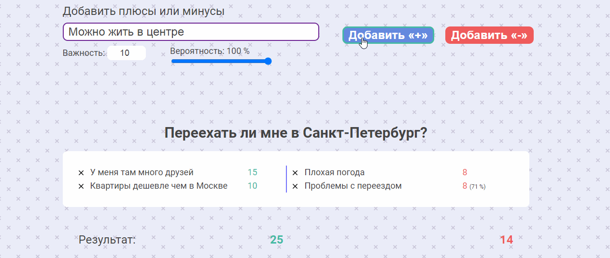
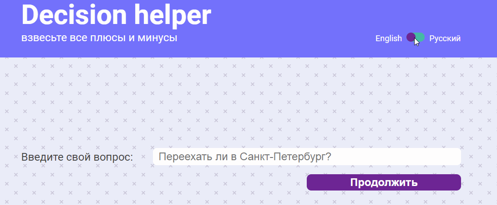

#  Decision helper

---

[Decision helper](http://decision-helper.ru/) — это веб-приложение, упрощающее процесс принятия решения. 

Введите запрос и укажите положительные и отрицательные стороны этого решения, а также значимость для вас каждой причины. Приложение посчитает, какая сторона перевешивает. А также составит круговые диаграммы плюсов и минусов этого решения.

### Пример:

---

#### Интерфейс приложения разработан на двух языках: русском и английском.

---

#### Приложение полностью адаптивно, поддерживает экраны мобильных устройств, включая iPhone 5/SE.

---

#### При разработке использовалось:
* HTML / CSS (SCSS) / JS
* Vue.js, vue-cli, vuex, simple-vue-validator
* Библиотека Chart.js

---

#### Идея, дизайн и реализация моих рук дело. :star2: 
По всем вопросам можете писать в [телеграм](https://t.me/dr_fanis), особенно если хотите взять меня на работу. :alien:

